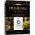

* ***学习方向：*** C语言
* ***必读书籍：***
	* c prime plus：可以作为学习的第一本书，完整详细的介绍了C语言语法和常用库函数。
	* C程序设计语言（K&R版）：被誉为C语言中的圣经，C语言作者写的，有一定阅读难度。推荐在阅读第一本书的过程中，穿插阅读本书作为复习和巩固。
* ***选读书籍：***
	* C和指针：偏基础语法学习，可以偶尔翻翻查漏补缺。
	* C专家编程：涉及知识面较广，不适合在一开始阅读，当有了Linux下的C语言编程基础后，再回过头来看更适合。
	* C陷阱与缺陷：不算简单也不不算难，可以先翻翻，看不懂不要紧，留个印象即可。
* ***学习要点：*** 此时作为刚入门的初学者，需要注意合理分配看书与编程的时间，编程与阅读时间的比例最起码大于等于 3 : 2。
* ***目标：*** 在阅读完必读的两本书后，无论是否对于选读的书有所涉猎，用代码完成的习题数量都应该在50题以上，这时，应该形成了基本的编程思维，这是初期学习最重要的目标，就是需要能将抽象的想法转化成逻辑表达形式。
* ***时间限制：*** 大约花费3个月的时间，因为入门一向很难，因此时间设定为3个月，其中还包括了对于大一众多繁琐的公修课程的考虑，因此务必在大一上学期第三个月结束的时候完成本阶段的学习。这一阶段比较难，因为涉及到从无到有的学习，所以如果能从高三毕业的暑假就开始，会轻松点。
* ***阶段任务：*** 从推箱子、坦克大战、泡泡堂、雷电……等等小游戏中挑选一个，实现其最核心的玩法即可，针对游戏功能的复杂性，时间可以限制在15天～30天不等。考察点：
	* 如何使用外部库来完成图形绘制工作，例如SDL库 
	* 基本编程思想，将抽象玩法转变成逻辑形式 
	* 检索能力，包括寻找素材、bug解决方法、临时需要学的知识等。
